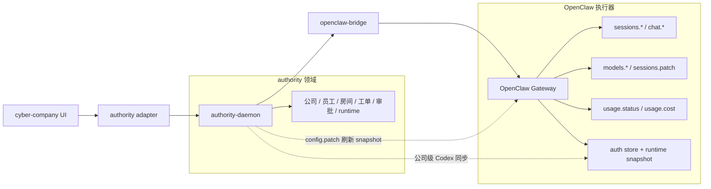
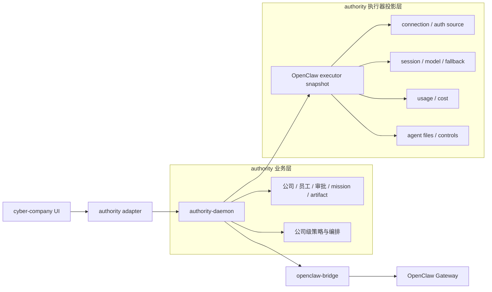

# OpenClaw Capability Matrix

Status: Draft  
Last updated: 2026-03-14

## 1. 目标

这份文档的目标不是把 `authority` 做成 OpenClaw 的镜像壳，而是明确：

- 哪些能力属于 `OpenClaw` 的原生执行器语义，应该尽量 1:1 对接
- 哪些能力属于 `authority` 的业务编排语义，应该继续保持独立
- 当前 `cyber-company` 的接入层在哪些地方已经很接近原生，哪些地方仍存在概念分叉

核心原则只有一句：

> `authority` 应独立于 OpenClaw 的业务编排，但不应独立于 OpenClaw 的执行器真相。

## 2. 当前架构

## 3. 目标架构

目标不是去掉 `authority`，而是把它收成两层：

- `业务层`
- `执行器投影层`

其中执行器投影层尽量贴 OpenClaw 原生概念，而不是再次发明一套执行状态。

## 4. Capability Matrix

| Capability Domain | OpenClaw Native Source | 当前 authority 状态 | 当前缺口 / 失真 | 目标对接形态 | Priority |
|---|---|---|---|---|---|
| Connection state | `health` + gateway websocket state | 已有 `openclaw-bridge` 和 `executor.status` | 状态仍偏 authority 术语，缺 `ping/authSource/version/restarting` | authority 暴露原生控制面快照 | P0 |
| Auth source / auth profile | gateway 握手、auth store、profile state | 当前公司级同步主要靠本地文件 fan-out | “同步成功”不等于“运行时已恢复”；UI 缺少原生 auth source 真相 | auth 作为原生执行器状态暴露；公司级同步只做 orchestration | P0 |
| Session identity | `sessionKey`、`sessionId`、`sessions.list` | 已通过 `sessions.list/history/reset/delete` 做薄代理 | 前端/adapter 默认把很多会话收成 `agent:{actorId}:main` | session 1:1 使用原生 key/id；authority 只额外挂公司上下文 | P0 |
| Chat send / abort | `chat.send`、`chat.abort` | 已较接近原生 | 会话恢复和错误语义还没有完全按 session 原生状态校验 | send path 保持薄代理；恢复逻辑按原生 session 状态闭环 | P0 |
| Model selection | `models.list`、`sessions.patch`、session metadata | 已接了一部分 | `selected model`、`active model`、`fallback model` 还会混淆 | authority 明确区分 selected / active / fallback | P0 |
| Fallback semantics | session metadata / fallback notice / runtime result | 当前未完整透传 | UI 难看出“为何降级、是否已恢复” | fallback reason 成为一等字段 | P0 |
| Thinking / verbose | `chat.history`、`sessions.patch` | 近期已打通 thinking level 透传 | 仍主要体现在聊天路径，没有纳入统一 session snapshot | thinking / verbose 作为原生 session 属性展示和修改 | P1 |
| Usage / quota | `usage.status` | authority 侧已可拿 cost，usage 侧语义还不够中心化 | 一些限额判断仍会被聊天错误、旧状态污染 | quota/usage 只认 `usage.status` 原生结果 | P0 |
| Cost usage | `usage.cost` | 已经较接近原生 | 当前更多是单点能力，未成为统一 executor snapshot 的一部分 | 作为执行器投影层标准能力 | P1 |
| Agent controls | `agents.list`、`agents.files.*`、agent model/skills override | 已有大量薄代理 | 业务层仍可能绕过原生状态做推断 | agent controls 继续保持薄代理 + 原生 DTO | P1 |
| Gateway lifecycle | `config.get/patch`、重启/重载、draining | authority 目前已能补偿重连 | 对 UI 来说仍然像“系统故障”，不是原生生命周期 | 将 restarting / reconnecting / draining 暴露成显式状态 | P1 |
| Company auth overlay | authority 自己维护 | 当前已实现 fan-out 和子 agent 清理 | 是旁路集成，不是 OpenClaw 原生能力 | 明确标记为 authority orchestration，不把它伪装成原生 auth 真相 | P0 |

## 5. 哪些应直接贴 OpenClaw 原生概念

### 5.1 Connection & lifecycle

应直接贴 OpenClaw 的包括：

- gateway connection state
- last ping / health latency
- auth source
- current endpoint / gateway version
- restarting / reconnecting / draining

参考 OpenClaw 原生实现：

- `apps/macos/Sources/OpenClaw/ControlChannel.swift`

### 5.2 Sessions & chat

应直接贴 OpenClaw 的包括：

- `sessionKey`
- `sessionId`
- `thinkingLevel`
- `verboseLevel`
- session 当前 `model`
- session 当前 `modelProvider`
- session fallback 信息

参考 OpenClaw 原生实现：

- `apps/macos/Sources/OpenClaw/SessionData.swift`

### 5.3 Usage & cost

应直接贴 OpenClaw 的包括：

- provider usage windows
- reset time
- remaining percentage
- 30 day cost usage

参考 OpenClaw 原生实现：

- `apps/macos/Sources/OpenClaw/UsageData.swift`
- `apps/macos/Sources/OpenClaw/UsageCostData.swift`

## 6. 哪些继续是 authority 自己的业务能力

这些不应 1:1 对齐 OpenClaw，而应继续保持 authority 独立：

- 公司
- 员工
- 部门
- 房间
- dispatch / approval / support request / escalation
- mission / artifact / requirement aggregate
- 公司级授权策略
- 公司级员工 fan-out 策略

OpenClaw 不需要理解这些；它只需要继续做执行器。

## 7. 当前 authority 已经接近原生的部分

下面这些已经接近“薄代理”：

- `sessions.list`
- `chat.history`
- `sessions.reset`
- `sessions.delete`
- `chat.send`
- `agents.files.*`

对应位置：

- `packages/authority-daemon/src/server.ts`

这部分方向是对的，后续应该继续保持薄，而不是再加更多 authority 自己的状态推断。

## 8. 当前最偏离原生的部分

### 8.1 公司级 Codex 同步

当前路径是：

1. 读取本地 Codex 凭据或 OpenClaw 主 auth store
2. 改主 agent `auth-profiles.json`
3. 清理子 agent 的 `openai-codex:*`
4. 通过 `config.patch` 强制刷新 OpenClaw runtime snapshot

这条路能工作，但本质上是 `authority` 的兼容层，不是 OpenClaw 原生 auth 能力。

对应位置：

- `packages/authority-daemon/src/openclaw-local-auth.ts`
- `packages/authority-daemon/src/gateway-runtime-refresh.ts`

### 8.2 Session 恢复与 fallback 展示

当前 authority 对“session 是否恢复成功”的判定，仍有部分路径不是完全按 OpenClaw 原生 session 状态来核。

更合理的目标是：

- 只要 session 仍在 fallback，就明确显示 fallback
- 只要 active model 还不是目标模型，就不算恢复成功

## 9. 建议的落地顺序

### Slice A：原生执行器快照

先在 authority 里补一个统一的 executor snapshot，至少包含：

- `connection`
- `authSource`
- `gatewayVersion`
- `sessions`
- `usage`
- `cost`

### Slice B：session 原生化

把当前前端和 authority adapter 里的默认 `agent:{actorId}:main` 视角，升级成“以原生 session 为主，以 actor/company 为附加上下文”。

### Slice C：auth 恢复判定原生化

把“同步成功”改成“OpenClaw 原生状态已恢复成功”：

- 主 auth profile 正确
- 子 agent 不再覆盖
- active session model 已恢复
- usage.status 与当前 provider 状态一致

### Slice D：UI 按原生状态展示

尽量像 OpenClaw macOS 客户端一样，围绕：

- connection
- auth
- sessions
- usage
- cost

这五类原生概念组织执行器面板。

## 10. 一句话结论

`authority` 不应该再造一套执行器状态；它应该成为：

- `OpenClaw 原生执行器能力` 的稳定对接层
- `公司/员工/业务编排能力` 的独立业务层

这样既能保留独立性，也能把接入体验尽量拉回 OpenClaw 原生体验。
