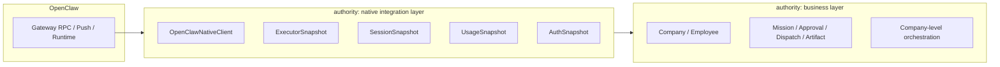

# OpenClaw Native Integration Plan

Status: Draft  
Last updated: 2026-03-14  
Related docs:

- `docs/openclaw-capability-matrix.md`
- `docs/v1-phase3-authority-object-boundaries.md`

## 1. 目标

这份文档承接 capability matrix，进一步回答：

- 当前 `authority` 哪些接口已经接近 OpenClaw 原生对接
- 哪些 contract / DTO 还缺关键原生字段
- 应该如何把 `authority` 收成：
  - 一层 `OpenClaw native integration layer`
  - 一层 `authority business orchestration layer`

## 2. 分层目标



关键原则：

1. 原生执行器状态只在一层里解释一次  
2. 业务层只消费整理好的原生快照  
3. 业务层不再自行推断 quota / fallback / active model / auth 恢复结果

## 3. 当前实现里已经比较对的部分

### 3.1 会话与聊天接口已接近薄代理

当前 `authority-daemon` 已经直接代理下面这些能力：

- `sessions.list`
- `chat.history`
- `sessions.reset`
- `sessions.delete`
- `chat.send`
- `agents.files.*`

对应位置：

- `packages/authority-daemon/src/server.ts`

这说明主链方向没有错：`authority` 完全可以贴着 OpenClaw 的原生 RPC 提供能力。

### 3.2 authority 前端适配器已经保留了 provider 概念

`authority` adapter 已经把自己当成一个 provider backend：

- `src/infrastructure/gateway/authority/adapter.ts`

这一步是对的，但当前还有一个关键缺口：

- adapter 仍会把默认会话合成成 `agent:{actorId}:main`
- 这让 session 原生语义被弱化成“actor 的默认聊天”

## 4. 当前需要优先补齐的 contract / DTO

## 4.1 ExecutorSnapshot：补成原生控制面快照

### 当前问题

当前 `AuthorityExecutorConfig` 和 health/bootstrap 中的 executor 数据还偏“authority 诊断视角”，缺少很多 OpenClaw 原生控制面字段：

- `authSource`
- `pingMs`
- `gatewayVersion`
- `endpoint`
- `restarting`
- `draining`
- `lastRestartAt`

### 建议新增

```ts
type AuthorityExecutorNativeSnapshot = {
  provider: "openclaw";
  connection: {
    state: "disconnected" | "connecting" | "connected" | "degraded";
    endpoint: string | null;
    pingMs: number | null;
    lastConnectedAt: number | null;
    lastError: string | null;
    restarting: boolean;
    draining: boolean;
  };
  auth: {
    source: "device-token" | "shared-token" | "bootstrap-token" | "password" | "none" | null;
    sourceLabel: string | null;
    tokenConfigured: boolean;
    accountId: string | null;
    profileId: string | null;
  };
  gateway: {
    version: string | null;
    configHash: string | null;
  };
};
```

### 落点

- `src/infrastructure/authority/contract.ts`
- `packages/authority-daemon/src/server.ts`
- `packages/authority-daemon/src/openclaw-bridge.ts`

## 4.2 SessionSnapshot：补成真正的原生 session 状态

### 当前问题

当前 `GatewaySessionRow` 还太薄，缺少很多影响真实体验的字段：

- `selectedModel`
- `activeModel`
- `activeModelProvider`
- `thinkingLevel`
- `verboseLevel`
- `fallbackReason`
- `authProfileOverride`
- `lastError`
- `contextTokens/inputTokens/outputTokens/totalTokens`

### 建议新增

```ts
type GatewaySessionRuntimeSnapshot = {
  key: string;
  sessionId?: string | null;
  actorId?: string | null;
  kind?: "direct" | "group" | "global" | "unknown";
  label?: string;
  updatedAt?: number | null;

  selectedModel?: string | null;
  selectedModelProvider?: string | null;
  activeModel?: string | null;
  activeModelProvider?: string | null;

  thinkingLevel?: string | null;
  verboseLevel?: string | null;
  authProfileOverride?: string | null;

  fallbackReason?: "auth" | "usage" | "provider" | "model" | "runtime" | null;
  fallbackSelectedModel?: string | null;
  fallbackActiveModel?: string | null;

  lastError?: string | null;

  contextTokens?: number | null;
  inputTokens?: number | null;
  outputTokens?: number | null;
  totalTokens?: number | null;
};
```

### 落点

- `src/infrastructure/gateway/openclaw/sessions.ts`
- `src/infrastructure/authority/contract.ts`
- `src/infrastructure/gateway/authority/adapter.ts`
- 聊天页 / runtime 面板

## 4.3 AuthSyncResult：从“文件同步结果”升级成“恢复结果”

### 当前问题

当前公司级 Codex 同步的返回值主要还是围绕：

- `profileId`
- `syncedAgentIds`
- `changed`
- `gatewayRefresh`

这还不足以回答用户真正关心的问题：

- 现在实际使用的是哪个账号
- session 是不是已经恢复到目标模型
- fallback 还在不在
- quota / usage 是否正常

### 建议新增

```ts
type AuthorityCompanyCodexRecoveryResult = {
  ok: true;
  companyId: string;
  changed: boolean;
  source?: "cli" | "gateway";
  profileId: string;
  syncedAgentIds: string[];

  auth: {
    accountId: string | null;
    email: string | null;
    source: "cli" | "gateway";
  };

  runtime: {
    refreshed: boolean;
    restarted: boolean;
    reconnected: boolean;
    reconnectAttempts?: number;
  };

  validation: {
    mainProfileAligned: boolean;
    childOverridesCleared: boolean;
    activeSessionsRecovered: boolean;
    usageHealthy: boolean | null;
  };
};
```

### 落点

- `src/infrastructure/authority/contract.ts`
- `packages/authority-daemon/src/openclaw-local-auth.ts`
- `packages/authority-daemon/src/gateway-runtime-refresh.ts`
- `packages/authority-daemon/src/server.ts`

## 4.4 UsageSnapshot：直接把 provider usage 升成标准能力

### 当前问题

当前 `usage.cost` 已经是独立能力，但 `usage.status` 还没有在 authority 里形成统一的 executor 快照对象。

### 建议新增

```ts
type AuthorityExecutorUsageSnapshot = {
  updatedAt: number;
  providers: Array<{
    providerId: string;
    displayName: string;
    plan?: string | null;
    windows: Array<{
      label: string;
      usedPercent: number;
      resetAt?: number | null;
    }>;
    error?: string | null;
  }>;
};
```

### 落点

- authority contract
- runtime / settings / connect 页面

## 5. 建议新增的 Native Integration 层

## 5.1 结构建议

当前有：

- `openclaw-bridge`
- `authority adapter`
- `server.ts` 里的若干 proxy 路由

建议继续收成 3 个明确模块：

### A. `OpenClawNativeClient`

职责：

- 封装对 OpenClaw gateway 的原生 RPC / push
- 不引入 company 语义
- 返回尽量原生的 DTO

示例能力：

- `getHealth()`
- `listSessions()`
- `getSessionHistory()`
- `patchSessionModel()`
- `patchSessionThinking()`
- `getUsageStatus()`
- `getUsageCost()`
- `listAgents()`
- `listAgentFiles()`

### B. `OpenClawExecutorProjection`

职责：

- 把原生 DTO 收成 authority 内部统一的 `ExecutorSnapshot`
- 但仍然保持 OpenClaw 原生字段

### C. `AuthorityBusinessOrchestrator`

职责：

- 把 company / employee / mission / approval 等业务语义叠加到 executor 快照之上
- 做公司级授权 fan-out、员工恢复策略、业务流程驱动

## 6. 迁移切片

## Slice 1：ExecutorSnapshot 落地

目标：

- 先把 connection/auth/usage 这些原生控制面状态收进 contract

改动点：

- `src/infrastructure/authority/contract.ts`
- `packages/authority-daemon/src/server.ts`
- `packages/authority-daemon/src/openclaw-bridge.ts`

完成标准：

- settings / connect 页面能直接显示原生 executor snapshot

## Slice 2：Session 原生化

目标：

- 把 session 列表、历史、当前模型、fallback 信息补齐

改动点：

- `src/infrastructure/gateway/openclaw/sessions.ts`
- `src/infrastructure/authority/contract.ts`
- `src/infrastructure/gateway/authority/adapter.ts`

完成标准：

- 聊天页能同时分清：
  - `selected model`
  - `active model`
  - `fallback reason`

## Slice 3：Auth 恢复判定原生化

目标：

- 把“同步授权成功”升级成“OpenClaw 原生状态恢复成功”

改动点：

- `packages/authority-daemon/src/openclaw-local-auth.ts`
- `packages/authority-daemon/src/gateway-runtime-refresh.ts`
- `packages/authority-daemon/src/server.ts`

完成标准：

- 同步后能明确回答：
  - 账号是否切对
  - session 是否恢复
  - usage 是否健康

## Slice 4：业务层只消费 Native Projection

目标：

- 页面和业务逻辑不再直接猜测 executor 状态

完成标准：

- 业务层不再自行推断 quota / auth / fallback / active model

## 7. 当前最值得立即做的事

如果只选最值钱的 3 件事，我建议顺序是：

1. `ExecutorSnapshot` 原生化  
2. `SessionSnapshot` 原生化  
3. `AuthSyncResult` 恢复结果化

这三刀落完，当前最痛的体验问题基本都会明显收敛：

- 授权成功但还是限额
- session 明明恢复了却显示不对
- 模型标签和实际运行模型不一致
- fallback 发生了但页面看不清

## 8. 一句话结论

正确方向不是继续给 `authority` 打补丁，而是把它收成：

- 一层稳定的 `OpenClaw native integration layer`
- 一层真正有业务价值的 `authority orchestration layer`

只要这条边界切对，`cyber-company` 接入 OpenClaw 的体验就会明显更接近原生。
